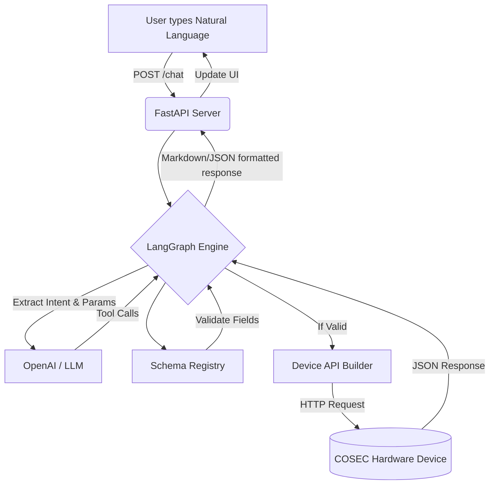
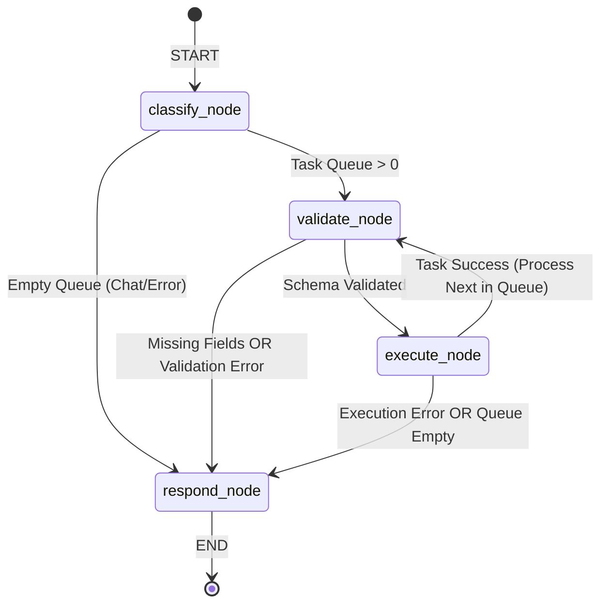
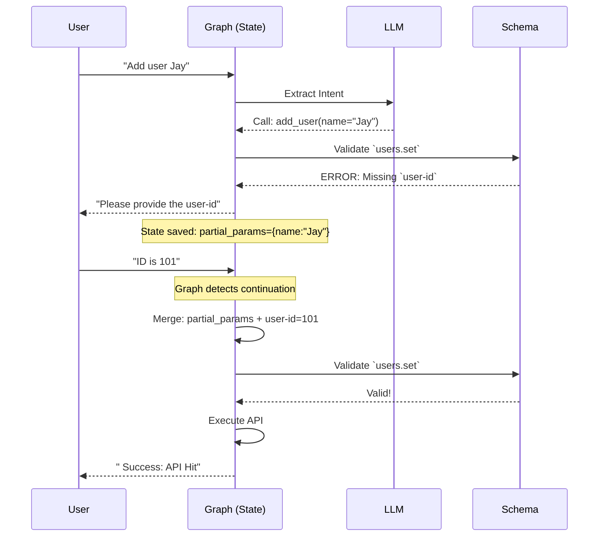

# CoSec AI Copilot 🔒

**CoSec AI Copilot** is a state-of-the-art, natural-language-driven interface designed to control and manage complex COSEC access control devices. It bridges the gap between rigid, legacy hardware APIs and fluid, intuitive human conversation.

---

## 🎯 The Problem
Managing physical security and access control panels (like adding users, setting door configurations, or changing enrollment options) traditionally requires deep knowledge of rigid REST/CGI APIs, exact parameter names, and strict documentation. 
* Users struggle to remember the precise API paths and required fields (e.g., `pdid`, `ref-user-id`).
* Performing multiple tasks requires multiple separate, tedious manual API calls.
* When a user forgets a single parameter, traditional systems simply throw a generic `400 Bad Request` error.

## 💡 Our Solution
We built an **Agentic AI Copilot** that translates vague, conversational commands into precise, validated hardware API requests. 
* **Multi-Tasking:** Users can say `"Add user Jay and delete user 5"`, and the Copilot processes them sequentially.
* **Contextual Memory (Multi-Turn):** If a user says `"Set door configuration"`, the Copilot knows it needs a `pdid` (Door ID), stops, and asks the user for it. When the user replies `"1"`, it remembers the context and seamlessly continues execution.
* **Schema Validation:** The Copilot internally validates all AI-extracted parameters against strict device schemas *before* hitting the physical hardware, ensuring 100% safe API calls.

---

## 🛠️ Technology Stack
### Backend
* **Python 3 & FastAPI:** Provides lightning-fast, asynchronous REST endpoints for the chat interface.
* **LangChain & OpenAI (GPT):** Powers the core intent classification and parameter extraction using advanced Function Calling.
* **LangGraph:** Drives the stateful, cyclic pipeline. It acts as the "Brain" of the Copilot, managing the task queue, multi-turn memory, and execution flow.

### Frontend
* **Vanilla HTML / CSS / JS:** A highly responsive, glassmorphism-inspired chat interface.
* Features real-time typing indicators, API connection status badges, and dynamic JSON response rendering without the overhead of heavy frameworks like React.

---

## 🏗️ System Architecture

Our system is cleanly separated into a responsive web frontend, a FastAPI routing layer, and an AI-driven LangGraph Engine.



---

## 🧠 LangGraph Implementation & Routing Logic

LangGraph is the core orchestration engine of the Copilot. Instead of a simple linear script, our system is built as a **Cyclic State Graph**. This allows the AI to pause, ask questions, and resume without losing context.

**The graph consists of exactly 4 Nodes and highly specific Conditional Edges:**



### 1. The Nodes (The "Workers")

* **`classify_node` (The Brain):** The entry point. It takes the user's natural language input and passes it to the OpenAI LLM. The LLM is equipped with 17+ different tool schemas. If the LLM identifies an intent, it outputs Tool Calls which are added to the `Task Queue`. If the user is simply answering a previous question (e.g., typing "1"), this node detects the continuation and merges the new parameter into the pending task.
* **`validate_node` (The Gatekeeper):** Pops the current task from the queue and checks it against the **Schema Registry**. It strictly enforces the COSEC API rules. If a task requires a `user-id` and the AI didn't provide one, it stops the graph from executing and prepares to ask the user.
* **`execute_node` (The Hands):** Safely translates the clean, validated parameters into a physical URL (e.g., `/device.cgi/users?action=set...`) and fires the HTTP request to the COSEC hardware.
* **`respond_node` (The Voice):** The final step. It aggregates all successful executions, missing field questions, and errors, formatting them into a rich Markdown/JSON response for the UI.

### 2. The Conditional Edges (The "Routers")

The edges determine where the graph goes next based on the `CopilotState`:

* **`_route_classify`**: 
  * If `tasks` are present in the state ➡️ Route to `validate_node`.
  * If no tasks (meaning the AI didn't understand the command) ➡️ Route to `respond_node` to output an error.
* **`_route_validate`**: 
  * If `missing_fields` is populated (e.g., missing a door ID) ➡️ Route to `respond_node` to ask the user.
  * If `execution_result` contains an error (e.g., invalid parameter type) ➡️ Route to `respond_node` to show the error.
  * If everything is valid ➡️ Route to `execute_node`.
* **`_route_execute`**: 
  * If the API call fails ➡️ Route to `respond_node` to halt and show the error.
  * If the API call succeeds, AND there are still tasks left in the queue ➡️ Route back to `validate_node` to process the next task (This creates the cyclic loop for Multi-Tasking!).
  * If the queue is empty ➡️ Route to `respond_node` to summarize all successes.

---

## 🔄 Multi-Turn State & Task Queueing

How does the system remember things across multiple messages? We use a central `CopilotState` dictionary powered by LangGraph's `MemorySaver`.



---

## 💻 Key Code Features

### 1. The Single Source of Truth (`state.py`)
Instead of passing random variables around, the entire application state is strictly typed.
```python
class CopilotState(TypedDict):
    messages: Annotated[list, add_messages]
    tasks: List[Dict]               # Queue of upcoming tasks
    partial_params: Dict            # Context saved between turns
    missing_fields: List[str]       # Fields the user needs to answer
    completed_results: List[Dict]   # Accumulated API results
```

### 2. Intelligent Continuation (`nodes.py`)
If the user provides an answer to a missing field, the system merges it automatically without restarting the whole process:
```python
# Check if this is a continuation where the LLM just re-issued the pending task
if tasks and missing_fields and new_tasks[0]["intent"] == tasks[0]["intent"]:
    merged_params = {
        **(state.get("partial_params") or {}),
        **new_tasks[0]["params"]
    }
    update.update({
        "partial_params": merged_params,
        "missing_fields": [], # Cleared! Ready to execute!
    })
```

### 3. Beautiful API UI Rendering (`ui.js`)
The frontend loops through all executed tasks in a single turn and builds interactive data blocks:
```javascript
const successes = details.successes || [];
for (const s of successes) {
  const lbl = s.mock ? ' MOCK' : '🌐 API';
  html += `<div class="api-row"><div class="api-pill">${lbl}: ${s.url}</div></div>`;
  
  if (s.response) {
    const respText = JSON.stringify(s.response, null, 2);
    html += `<div class="api-response">${respText}</div>`;
  }
}
```

---

## 🚀 How to Run

1. **Install dependencies:**
   ```bash
   pip install fastapi uvicorn langchain langchain-openai langgraph
   ```

2. **Configure Environment:**
   Edit `app/config.py` to add your OpenAI API Key (or set `USE_MOCK = True` to test without an API key).

3. **Start the server:**
   ```bash
   uvicorn app.main:app --reload
   ```

4. **Open the App:**
   Navigate to `http://127.0.0.1:8000` in your browser.
